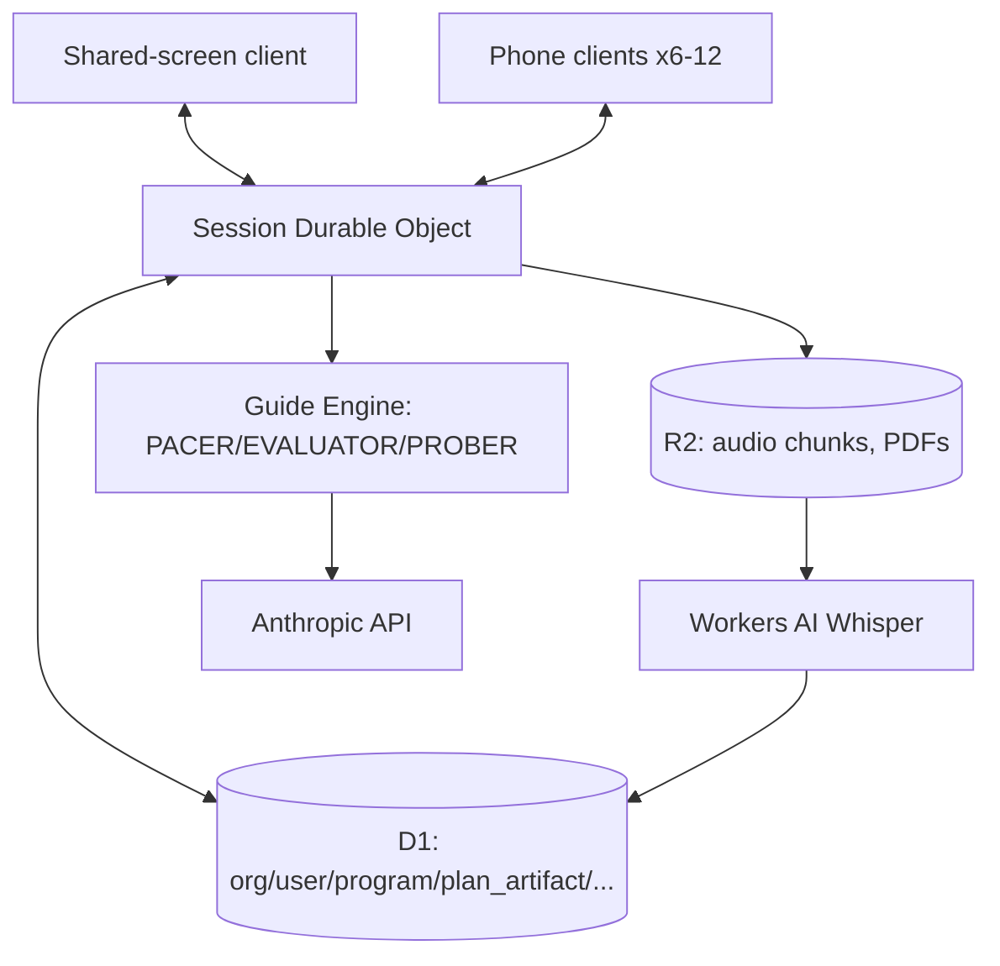

# Groundwork — AI-Facilitated Strategic Planning for Faith-Based Organizations

**Status**: Phase 0 (Scaffold) — no product code yet, platform substrate only.
**Repo**: `jersilb1400/groundwork`
**Stack**: Cloudflare Workers, Durable Objects, D1, R2, Workers AI (Whisper), React + Vite PWA, Anthropic API, Stripe.
**Goal**: Walk a faith-based organization's leadership team through four full-day working sessions, purely AI-led, and leave them with a plan they actually run — not a binder that dies on a shelf.

"Groundwork" is a placeholder name pending Jeremy's trademark check (§2.4 of the build plan). Do not treat it as final in marketing or legal contexts.

---

## Current Status (Living — Updated After Every Session)

**As of 2026-07-26**:
- Confirmed working: Wrangler config, local D1 schema migration, stub Durable Object, vocabulary lint (with self-test), CI pipeline.
- In progress: nothing — Phase 0 gate is the current milestone.
- Known blockers: none. Live Cloudflare resource provisioning (real D1/R2 instances) is deliberately not done yet — it needs Jeremy's account credentials present.

**Next Priorities**:
1. Phase 1 — session spine: Durable Object with real WebSocket fanout, join-by-code, three-device no-divergence test. Owner: `session-spine-engineer`.
2. Guide Engine architecture (§5): segment spec schema, five-agent contracts. Owner: `guide-engine-architect`.
3. Line up two or three willing pilot churches before Phase 8 becomes urgent — the plan calls this out explicitly as a now-task, not a later one.

---

## Architecture / System Design

Two separate agent graphs exist in this repo. Do not conflate them:

1. **The build team** (`docs/agent-team.md`, `.claude/agents/`) — the subagents that build Groundwork. Brain/hands/verifier graph, following the `async-agent-graph-engineering` skill.
2. **The Guide Engine** (§5 of the build plan, designed by `guide-engine-architect`) — PACER, EVALUATOR, PROBER, SYNTHESIZER, COACH. This *is the product*. It runs live, in front of a church leadership team, for eight hours at a stretch.



Key components:
- `src/index.ts` — Worker entry point, health route.
- `src/session-do.ts` — `SessionDO`, one per session (`session:{orgId}:{labId}:{sessionId}`). **Stub only in Phase 0** — real implementation is Phase 1.
- `migrations/0001_init.sql` — the full data model from §4 of the build plan.
- `content/packs/church/` — curriculum as data (does not exist yet; Phase 8).

Full detail → `docs/architecture.md`. Full build sequence and gates → `docs/roadmap.md`.

---

## Build / Run / Deploy Instructions

```bash
npm install
npx wrangler dev                          # local dev server, no live Cloudflare account needed
npx wrangler d1 migrations apply groundwork --local   # applies migrations/0001_init.sql locally
node scripts/lint-vocabulary.mjs                       # fails if a banned trademark term is present
node scripts/lint-vocabulary.mjs --self-test           # proves the lint actually catches a planted term
```

Common pitfalls:
- `wrangler dev` defaults to local emulation for D1/DO/R2 — do not pass `--remote` unless you intend to hit real Cloudflare infrastructure under Jeremy's account.
- The vocabulary lint excludes files listed in `.vocabignore` (the guardrail files that must legitimately *name* banned terms as prohibitions). Do not add a real usage to that list to silence a genuine failure.

---

## Constraints & Non-Negotiables

- **IP firewall (§2 of the build plan) is the highest-risk part of this project.** The source manual never enters this repository — not as a file, pasted text, a prompt, or a vector store. No trademarked terms anywhere — see `docs/vocabulary.md` for the enforced list.
- **Strict doctrinal neutrality.** The guide never takes a theological position. Contested questions get handed to the room.
- **No live Cloudflare resources created without Jeremy present** — see `docs/decisions.md`.
- **Leader override is absolute.** Nothing in the product may be locked against the human in the room (§5.5).
- **EVALUATOR precision > 0.8 on the `thin` verdict is a hard gate** — Phase 2 does not proceed below it.
- Decision authority tiers (§10 of the build plan, restated in `AI_CEO_INSTRUCTIONS.md`) — never self-escalate.

---

## How to Work on This Project with Claude Code

Preferred prompt pattern:
> "Using `docs/agent-team.md` and the build plan, drive Phase [N]. Dispatch to the relevant builder hands, run the phase gate against its anchor, and report the gate result."

Claude will always:
- Read `DASHBOARD.md` and `HANDOFF.md` first if starting a session cold.
- Follow the decision-authority tiers in `AI_CEO_INSTRUCTIONS.md` — propose Tier 2, never touch Tier 3.
- Run the IP firewall check (`ip-firewall-guardian`) before any curriculum or public-facing content lands.
- Maintain this README as the living status source of truth.

---

*Customized for Groundwork from the `project-bootstrapper` template. See `docs/decisions.md` for why the scaffold lives at repo root instead of `PROJECTS/groundwork/`.*
